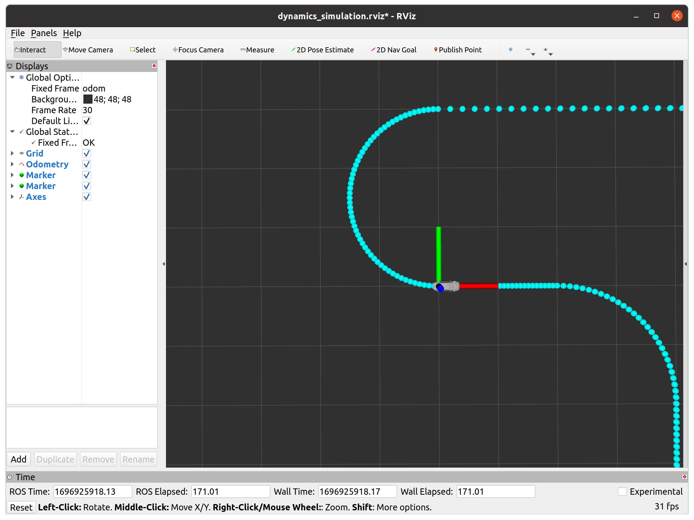

# simple_vehicle_sim

A simple ROS based car dynamics simulator.

## Install ROS

Follow either of the following.

(Skip this if you already has ROS environment.)

### Official Documentation

`Noetic` with `Ubuntu 20.04` is recommended.\
Reference: http://wiki.ros.org/noetic/Installation/Ubuntu

### Convenience Install Script
Using scripts located at `etc/` of this repository, depending on you Ubuntu version, run

- Ubuntu 20.04
> `sudo chmod 755 ./install_ros_noetic && bash ./install_ros_noetic.sh`
- Ubuntu 18.04
> `sudo chmod 755 ./install_ros_melodic && bash ./install_ros_melodic.sh`
- Ubuntu 16.04
> `sudo chmod 755 ./install_ros_kinetic && bash ./install_ros_kinetic.sh`

Note, aliases are setup in your `~/.bashrc`.\
To edit, run `gedit ~/.bashrc`.

## Download the Code

Run the following command to install all ROS dependencies for the `src/` directory.
```
cd ~/catkin_ws
rosdep install --from-paths src -r -y
```

## Install Python Dependencies

```
pip3 install numpy --user
pip2 install numpy --user
```
Note, ROS (~melodic) runs with `python 2.x`

## Permission setting
```
if you copy 'Assignment' directory in your catkin_ws/src, then

cd ~/catkin_ws/src/Assignment/simple_vehicle_sim/scripts
chmod 777 simulate_dynamics.py

cd ~/catkin_ws/src/Assignment/waypoint_follower/scripts
chmod 777 controller.py  wpt_loader.py
```

## Running the Simulator

Open a terminal and launch the simulation.
```
roslaunch simple_vehicle_sim run_sim.launch
```

> If the terminal cannot auto-complete the package (`simple_vehicle_sim`), run the following and try again.
> ```
> cd ~/catkin_ws
> rospack profile
> ```

If everything is successfull, you should see the following.
- ROS node rviz
> 

- ROS node graph
> Run the following command
> ```
> rqt_graph
> ```
> 

Publish control(steering and throttle) value to `/control` topic to test your own self-driving algorithms.

## Unit Conventions
The following applies to `controlSubCallback` in `script/simulate_dynamics.py`
| variable name | meaning / use in the code | units |
| ---           | ---     | ---   |
| `msg.drive.steering_angle` | front wheel angle relative to the car heading | rad |
| `msg.drive.acceleration`   | throttle level | - |
| `self.inputs[0]`           | normalized steer input(min:-1, max:1) | - |
| `self.inputs[1]`           | normalized throttle input(min:-1, max:1) | - |

## Note

- Parameters are located at `__init__` of `SimulateStep` class and `main` in `script/simulate_dynamics.py` to try out different settings.

- The topics `simulation/bodyOdom` and `simulation/poseOdom` are different that the former puts velocities in the body frame and the latter puts velocities in the map frame.

- Change the code freely to fit your needs.